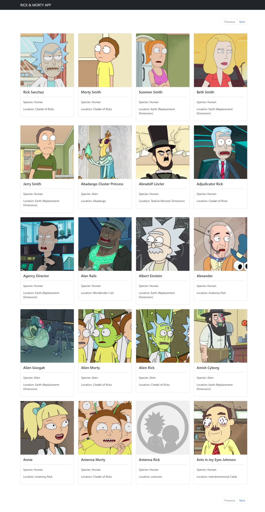

# Rick and Morty API
This design is inspired by the work of [MonkeyWit](https://www.youtube.com/@MonkeyWit). Click [here](https://youtu.be/BTJtTkoyprc?si=t9l-gIt0FtkH_xt9) to watch the video.

## Technologies
This web page was made with the following technologies:
- HTML5
- CSS3
- JavaScript
- React
- GH-pages

## Pages
On the homepage of this website, each character from "Rick and Morty" will be displayed with their respective name, species, and location. Additionally, in the upper left corner, there is a “next” button. Upon pressing it, you will be taken to the next page to view more characters.

